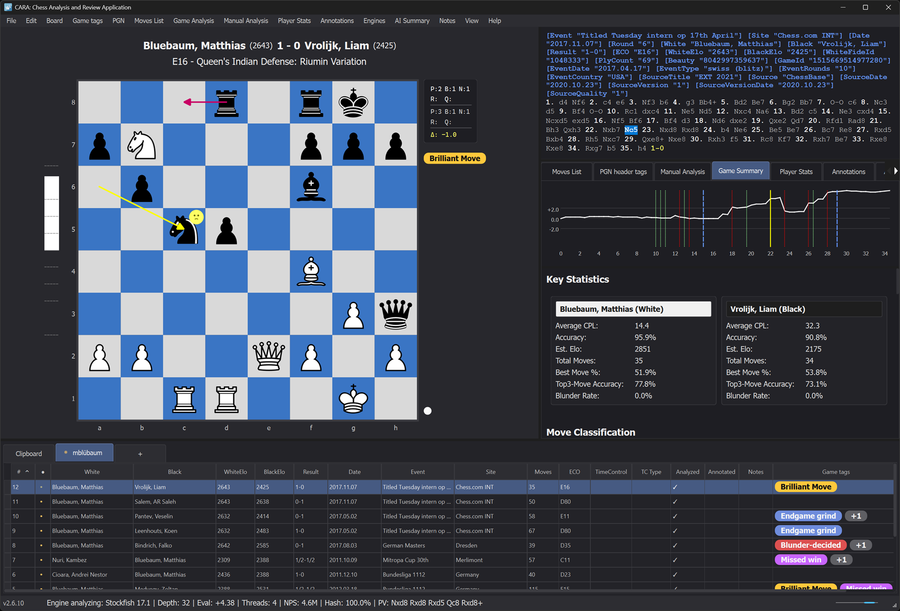

# CARA: Chess Analysis and Review Application

[](https://www.gnu.org/licenses/gpl-3.0)
[](https://www.python.org/downloads/)
[]()

**Version 2.5.5**

CARA is a full-featured desktop application designed for analyzing and reviewing chess games. Unlike chess playing applications or puzzle solvers, CARA focuses exclusively on post-game analysis and review, helping you understand your games, identify mistakes, recognize patterns, and improve your chess understanding.

CARA was built in large part by an AI model under the author's direction. The author took special care to ensure the AI adhered to the established architectural guidelines and coding conventions throughout the development process, while proposing the features, user stories, and UX design. This project served as an experiment to explore the feasibility of building a full-fledged, complex desktop application with Python using AI code completion, testing whether modern AI tools can produce polished, fully-featured software when guided by clear architectural principles and consistent oversight.



## Features

### Core Capabilities

- **PGN Database Management**: Complete management of chess game collections stored in PGN format. The system supports opening multiple PGN databases simultaneously, each displayed in its own tab for easy navigation. Powerful search functionality allows you to find games by player names, dates, openings, results, and other criteria. Built-in deduplication helps identify and remove duplicate games across databases. Bulk operations streamline common tasks: replace tags across multiple games, clean and format PGN content, and perform batch modifications. Import games from local PGN files or directly from online platforms like Lichess and Chess.com, with support for filtering by date range, game type, and other criteria.

- **Interactive Chessboard**: Beautiful, feature-rich chessboard at the heart of the application, providing an intuitive visual interface for game review and analysis. The board integrates seamlessly with game analysis and manual analysis through extensive visual indicators. Played move arrows highlight the last move made in the game, while best alternative move arrows indicate superior moves found during analysis. During manual analysis, PV1, PV2, and PV3 arrows display the principal variations from MultiPV analysis, allowing you to explore multiple candidate moves simultaneously. All arrows can be individually shown or hidden to customize the display according to your analysis needs. The board features a positional heatmap overlay that visualizes positional factors like weak squares, passed pawns, outposts, piece activity, and king safety through color-coded gradients. Additional toggleable elements include coordinate labels, turn indicator, game information panel, evaluation bar, and material widget. All visual elements are fully customizable through the configuration system.

- **Game Analysis**: Automatic analysis of chess games using UCI-compatible chess engines, with sophisticated move assessment through MultiPV (Multiple Principal Variations) analysis and before-and-after position evaluation. The system analyzes each move by comparing the position before and after the move, evaluating multiple candidate moves simultaneously, and calculating Centipawn Loss (CPL) to classify moves as Good, Inaccuracy, Mistake, Blunder, or Brilliancy. This thorough approach provides detailed evaluation metrics and move quality assessments. Supports both single game analysis and bulk analysis of entire databases.

- **Game Summary**: Complete game overview combining statistical analysis, key moments, and visual insights. The summary provides per-player statistics (accuracy, average CPL, move counts by classification), phase-by-phase performance breakdowns (Opening, Middlegame, Endgame), identification of top best and worst moves for each player, evaluation graph data, and automatically detected game highlights. The summary synthesizes all analysis data into a cohesive overview that helps you quickly understand the flow of the game, identify critical moments, and assess each player's performance across different phases of play.

- **Game Highlights**: Automatic detection of 44 tactical and positional patterns through an extensible rule-based system. The system includes rules for detecting pins, forks, skewers, batteries, discovered attacks, tactical sequences, positional improvements, evaluation swings, material imbalances, and many more patterns. Highlights are organized by game phase and help you quickly identify key moments. The rule-based architecture is designed for extensibility: new highlight detection rules can be easily added by implementing a simple rule interface, allowing the system to grow and adapt to detect additional patterns and tactical themes.

- **Moves List**: Centralized table view that encapsulates all important per-move information in one place. The moves list displays move notation, evaluations, move classifications, best move alternatives, Centipawn Loss (CPL) values, engine depth, material counts, FEN positions, and more across 32 available columns. The system features a flexible column profile management system, allowing you to create, save, and switch between different view profiles. Each profile can customize which columns are visible, their display order, and column widths, enabling you to tailor the view to your specific analysis needs—whether focusing on opening transitions, move assessment, or material tracking.

- **Player Statistics**: Extensive aggregated statistics across multiple games, providing deep insights into playing patterns and performance. You can analyze any player from any or all open databases. The system calculates overall performance metrics, breaks down performance by game phase (Opening, Middlegame, Endgame), and tracks opening usage and accuracy. The system detects error patterns such as phase-specific blunder tendencies, tactical misses, opening-specific errors, consistently high Centipawn Loss, missed opportunities, and conversion issues in winning positions. The view updates asynchronously in the background when databases change, ensuring you always have current data without blocking the interface.

- **Manual Analysis**: Perform continuous engine analysis on any position with MultiPV support. You can navigate through game positions while maintaining continuous analysis of the current position. Hovering over principal variation moves displays a beautiful optional miniature board showing the resulting position. Positional plan exploration extracts piece trajectories from PV lines, visualizing how pieces move through the engine's recommended plan on the chessboard. You can explore positional plans for up to three PV lines (PV1, PV2, PV3) independently, with configurable options for the number of pieces to track and exploration depth.

- **Annotations**: Powerful free-form annotation system for marking positions, ideas, and analysis insights. Unlike other chess applications, text can be freely positioned anywhere on the board, adjusted in size and rotated. In addition to text, you can add arrows, circles, and square highlighting with customizable colors. Annotations are position-specific, attached to individual moves in the game, and are compressed and serialized in a PGN metadata tag to keep the PGN move notation clean. This flexible annotation system enables you to create rich, personalized study materials and analysis notes.

- **AI Summary**: Interactive chat interface allowing you to discuss any position in a game with a Large Language Model (LLM). The AI model has access to extensive game data, including detailed engine analysis, move classifications, evaluation metrics, and positional information, enabling it to provide accurate assessments of the game, played moves, and current position. Generate AI-powered game summaries using OpenAI or Anthropic models.

- **Online Import**: Import games directly from Lichess and Chess.com with filtering options.

### Technical Features

- **Multi-Engine Support**: Works with any UCI-compatible chess engine (Stockfish, Shredder, Lc0, Komodo, Berserk, etc.)
- **Fully Customizable UI**: All styling, colors, fonts, and dimensions configurable via `config.json`
- **Responsive Architecture**: Built with PyQt6 using Model/View architecture with Controllers
- **Thread-Safe Operations**: Background analysis with progress tracking and cancellation support
- **Comprehensive Manual**: Built-in HTML user manual accessible from the Help menu

## System Requirements

- **Operating System**: The application has been tested on Windows 11 and macOS Tahoe 26.2. In general, CARA should also run on Linux, but it has not been tested on Linux and may require some minor adjustments.
- **Python**: 3.8 or higher (CARA uses PyQt6, which requires Python 3.8+)
- **Screen Resolution**: A minimum screen resolution of 1280×1024 pixels is recommended. Some dialogs require at least 800 pixels in width and 900 pixels in height to display properly. Lower resolutions may cause dialogs to be cut off or difficult to use.
- **Hardware**: No specific hardware requirements beyond what is needed to run Python and the operating system. For optimal performance when analyzing games with chess engines, a modern multi-core processor is recommended.

## Installation

> **App Bundles (Recommended)**: Pre-built application bundles are available for Windows and macOS, which include all dependencies and can be run directly without Python installation. See the [releases page](https://github.com/pguntermann/CARA/releases) for download options.
>
> **macOS users**: Due to macOS security settings, you may need to allow the app to run. If you see a security warning when trying to open the app, follow these steps:
> 1. Right-click the app and select "Open"
> 2. When the warning dialog appears, click "OK"
> 3. Open System Settings → Privacy & Security
> 4. Scroll down to find the blocked app notification and click "Open Anyway"
>
> After completing these steps, you can launch the app normally.

---

**Manual Installation**: The following subsections describe how to manually install Python and CARA dependencies, if you don't want to use the pre-built application bundles.

### 1. Install Python

CARA requires Python 3.8 or higher. If you don't have Python installed:

**Windows (using winget - Recommended):**
```bash
winget install Python.Python.3
```

**Windows (manual download):**
1. Download Python from [python.org](https://www.python.org/downloads/)
2. Run the installer and check "Add Python to PATH"
3. Verify installation: `python --version`

**macOS (using Homebrew - Recommended):**
```bash
brew install python3
```

**macOS (manual download):**
1. Download Python from [python.org](https://www.python.org/downloads/)
2. Run the installer and follow the installation wizard
3. Verify installation: `python3 --version`

**Note**: On Windows, if you see a "python is not recognized" error, Python may not be in your system PATH. Re-run the installer and ensure "Add Python to PATH" is checked, or manually add Python to your system PATH. For detailed instructions on manually adding Python to PATH, see the user manual. On macOS, you may need to use `python3` instead of `python` to access Python 3.

### 2. Install Dependencies

Navigate to the CARA directory and install required packages:

```bash
pip install -r requirements.txt
```

This installs:
- PyQt6 (>= 6.6.0)
- python-chess (>= 1.999)
- requests (>= 2.31.0)
- asteval (>= 0.9.31)
- charset-normalizer (>= 3.0.0)

**Note**: pip (Python package installer) is included with Python 3.4 and later. If you installed Python using the methods described above, pip should already be available. Verify pip is installed by running `pip --version` in your terminal.

#### Installation Troubleshooting

If pip is not available after installing Python, you can install it manually:

1. **Download get-pip.py**: Download the `get-pip.py` script from [bootstrap.pypa.io/get-pip.py](https://bootstrap.pypa.io/get-pip.py) and save it to a folder on your computer.
2. **Run the installer**: Open a terminal (PowerShell or Command Prompt on Windows, Terminal on macOS), navigate to the folder containing `get-pip.py`, and run: `python get-pip.py`  
   **Note**: On macOS, you may need to use `python3` instead of `python`.
3. **Verify installation**: After installation completes, verify pip is installed: `pip --version`

If you prefer to install dependencies individually instead of using the requirements file, you can install each library separately:

- `pip install PyQt6>=6.6.0`
- `pip install python-chess>=1.999`
- `pip install requests>=2.31.0`
- `pip install asteval>=0.9.31`
- `pip install charset-normalizer>=3.0.0`

After installing all dependencies, verify they are installed correctly using `pip list`.

### 3. Configure a Chess Engine

CARA requires a UCI-compatible chess engine. Recommended engines:
- **Stockfish**: [stockfishchess.org](https://stockfishchess.org/download/)
- **Berserk**: [github.com/jhonnold/berserk](https://github.com/jhonnold/berserk)

After downloading an engine, configure it in CARA via **Engines → Add Engine...**

## Usage

### Starting CARA

```bash
python cara.py
```

**Note**: On macOS, you may need to use `python3` instead of `python`.

### Quick Start

For detailed instructions, see the [user manual](https://pguntermann.github.io/CARA/manual.html).

1. **Ensure you have a chess engine configured**: Before starting, make sure you have at least one UCI-compatible chess engine added to CARA. Go to **Engines → Add Engine...** and select your UCI engine. If you're unsure which engine to choose, [Stockfish](https://stockfishchess.org/download/) is an excellent free option to get started.

2. **Open a game or paste PGN**: Open a PGN database using **File → Open PGN Database** (`Ctrl+O` / `⌘+O`), or paste PGN text into the Clipboard database using **Edit → Paste PGN to Clipboard DB** (`Ctrl+V` / `⌘+V`)—the pasted game gets loaded automatically.

3. **Switch to the Moves List view**: Press `F1` to switch to the Moves List tab, then press `3` to select the "Game Analysis - Full" profile. This profile displays all the important analysis columns you'll need to review the game.

4. **Start the game analysis**: Press `Ctrl+G` / `⌘+G` (or use **Game Analysis → Start Game Analysis**) to begin analyzing the game. Watch as the moves list fills in with evaluation data, move classifications, CPL values, and best move alternatives as the analysis progresses. Progress and estimated time remaining are shown in the status bar.

5. **Review the results**: Once analysis completes, you can review the per-move analysis directly in the Moves List, or press `F4` to switch to the Game Summary tab for a condensed overview showing key statistics, the evaluation graph, critical moments, and detected game highlights.

### Configuration Files

CARA uses three configuration files:

- **`app/config/config.json`**: This file contains all UI styling, layout dimensions, colors, fonts, and application-wide default settings. It defines the visual appearance and behavior of the application. You can customize CARA's appearance by modifying this file without changing any source code. The configuration system follows a strict structure with no hardcoded values in the application code, allowing you to completely customize the application's appearance.

- **`user_settings.json`**: This file stores your personal preferences and settings, including moves list column profiles, board visibility settings, PGN display options, engine configurations, AI model settings, and other user-specific configurations. The file is automatically created in the CARA root directory when you first save settings, and it persists your preferences between application sessions.

- **`engine_parameters.json`**: This file stores engine-specific parameters and options for each configured chess engine. Engine settings are automatically saved to this file when you configure engines through the application interface. Each engine entry includes per-task parameters (separate parameter sets for evaluation, game analysis, and manual analysis tasks), thread count, depth limits, time limits, and engine-specific UCI options.

## Documentation

### User Manual

[Online version](https://pguntermann.github.io/CARA/manual.html), or access from **Help → Open Manual** in the application

### Video Tutorials

[YouTube Channel](https://www.youtube.com/@CARA-Chess)

Technical documentation for developers:

### Architecture & UI

- **Architecture**: [`doc/architecture_outline.md`](doc/architecture_outline.md)
- **Dialog Style Guide**: [`doc/dialog_style_guide.md`](doc/dialog_style_guide.md)

### Core Systems

- **Engine Implementation**: [`doc/engine_implementation.md`](doc/engine_implementation.md)
- **PGN Database Management**: [`doc/pgn_database_management.md`](doc/pgn_database_management.md)
- **User Settings Persistence**: [`doc/user_settings_persistence.md`](doc/user_settings_persistence.md)
- **Online Import**: [`doc/online_import_implementation.md`](doc/online_import_implementation.md)

### Analysis Features

- **Game Analysis**: [`doc/game_analysis_implementation.md`](doc/game_analysis_implementation.md)
- **Manual Analysis**: [`doc/manual_analysis_implementation.md`](doc/manual_analysis_implementation.md)
- **Evaluation Bar**: [`doc/evaluation_bar_implementation.md`](doc/evaluation_bar_implementation.md)
- **AI Chat Integration**: [`doc/ai_chat_integration.md`](doc/ai_chat_integration.md)
- **Game Highlights**: [`doc/game_highlights_implementation.md`](doc/game_highlights_implementation.md)
- **Move Classification**: [`doc/move_classification_analysis.md`](doc/move_classification_analysis.md)
- **Phase Detection**: [`doc/phase_detection_implementation.md`](doc/phase_detection_implementation.md)
- **Player Statistics**: [`doc/player_stats_implementation.md`](doc/player_stats_implementation.md)
- **Positional Heatmap**: [`doc/positional_heatmap_implementation.md`](doc/positional_heatmap_implementation.md)

### UI Features

- **Moves List Columns**: [`doc/moveslist_columns_implementation.md`](doc/moveslist_columns_implementation.md)
- **Annotation System**: [`doc/annotation_system_implementation.md`](doc/annotation_system_implementation.md)
- **PV Hover Board Preview**: [`doc/pv_hover_board_preview.md`](doc/pv_hover_board_preview.md)

### Operations

- **Bulk Operations**: [`doc/bulk_operations_system.md`](doc/bulk_operations_system.md)

## Keyboard Shortcuts

- `←` / `→`: Navigate through game moves
- `Ctrl+G` / `⌘+G`: Start game analysis
- `Escape`: Cancel analysis
- `F1`: Switch to Moves List tab
- `F4`: Switch to Game Summary tab
- `Ctrl+Shift+K` / `⌘+Shift+K`: Configure classification settings
- `Ctrl+O` / `⌘+O`: Open PGN database
- `Ctrl+V` / `⌘+V`: Paste PGN to Clipboard database
- `Ctrl+Alt+V` / `⌘+⌥+V`: Paste PGN to active database

See the user manual for a complete list of keyboard shortcuts.

## License

CARA is released under the **GNU General Public License version 3 (GPL-3.0)**.

### What This Means for You

The GPL-3.0 license grants you the following freedoms:

- **Freedom to use**: You can use CARA for any purpose, including commercial use (e.g., chess trainers can use it with their students)
- **Freedom to study**: You have access to the source code to understand how CARA works
- **Freedom to modify**: You can modify CARA to suit your needs
- **Freedom to distribute**: You can share CARA with others

### License Requirements

When distributing CARA (whether modified or unmodified), you must:

- **Provide attribution**: Include the original copyright notice and license
- **Include source code**: Make the complete source code available to recipients
- **Use the same license**: Any modified versions or derivative works must also be licensed under GPL-3.0
- **Preserve notices**: Keep all copyright and license notices intact

### Why GPL-3.0?

GPL-3.0 was chosen for CARA because:

- **Dependency compatibility**: CARA uses GPL-3.0 licensed dependencies (PyQt6, python-chess), requiring GPL-3.0 compatibility
- **Prevents proprietary resale**: The copyleft provision ensures that CARA and any derivative works remain free and open source, preventing proprietary resale or rental
- **Allows commercial use**: You can use CARA commercially (e.g., in training, coaching, or analysis services) as long as you comply with the license terms
- **Protects user freedoms**: Ensures that users always have access to source code and can modify the software

### Important Notes

- **No warranty**: CARA is provided "as is" without any warranty. See the full license text for details.
- **Derivative works**: If you create a modified version of CARA, it must also be licensed under GPL-3.0 and you must make the source code available. This prevents proprietary forks while still allowing open-source improvements.
- **Commercial services**: You can offer commercial services using CARA (e.g., chess coaching, analysis services) without restrictions, as long as you comply with the license terms when distributing the software itself.

For the complete license text, see the [LICENSE](LICENSE) file in the CARA distribution or visit [gnu.org/licenses/gpl-3.0.html](https://www.gnu.org/licenses/gpl-3.0.html).

## Contributing

Contributions are welcome! Please feel free to submit issues, feature requests, or pull requests.

## Contact

For questions or inquiries, contact: [pguntermann@me.com](mailto:pguntermann@me.com)

## Acknowledgments

CARA relies on several open-source projects and resources:

- **Libraries**: 
  - [PyQt6](https://www.riverbankcomputing.com/software/pyqt/) (>= 6.6.0)
  - [python-chess](https://github.com/niklasf/python-chess) (>= 1.999)
  - [requests](https://requests.readthedocs.io/) (>= 2.31.0)
  - [asteval](https://github.com/newville/asteval) (>= 0.9.31)
  - [charset-normalizer](https://github.com/Ousret/charset_normalizer) (>= 3.0.0)

- **Chess Pieces**: Classic SVG set by [User:Cburnett](https://commons.wikimedia.org/wiki/User:Cburnett) hosted on [Wikimedia Commons](https://commons.wikimedia.org/wiki/Category:SVG_chess_pieces), licensed under [CC BY-SA 3.0](https://creativecommons.org/licenses/by-sa/3.0/) and the [GNU Free Documentation License 1.2](https://www.gnu.org/licenses/old-licenses/fdl-1.2.html)

- **Opening Resources**:
  - **ECO Database**: Based on [eco.json](https://github.com/hayatbiralem/eco.json) by hayatbiralem (MIT License), compiled by Ömür Yanıkoğlu, with credit to Shane Hudson for the original SCID opening data
  - **Polyglot Opening Books**: Polyglot format originally developed by Fabien Letouzey; see the [Polyglot repository](https://github.com/sshivaji/polyglot) maintained by sshivaji

The author expresses sincere appreciation to the developers and maintainers of these open-source projects and resources.

---

**Copyright (C) 2025 Philipp Guntermann**

Licensed under the GNU General Public License v3.0 (GPL-3.0)

